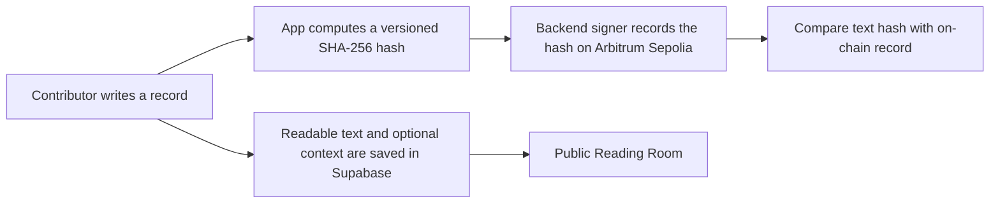

# Permanence Protocol

### An archive for records of thinking and work.

Permanence Protocol is an experimental public reading room. Contributors can preserve early questions, observations, hypotheses, findings, and other work, then invite others to support, challenge, or add evidence. Readers can inspect the archive without signing in.

> **Prototype status:** This project currently records content hashes on **Arbitrum Sepolia**, a test network. Readable text is stored in Supabase. This is not a guarantee of permanent availability, authorship, truth, or priority.

## Why I designed this

I wanted to explore a simple question: what if records of thinking and work could be returned to, checked, and built on later?

Online posts can be difficult to find again, and a claim about who said something first can be difficult to verify. Permanence Protocol is my experiment in keeping a record together with a time-stamped integrity check and a public conversation around it. A contribution does not have to be complete or proven to be worth preserving. The archive records what was submitted; it does not decide whether it is true.

This is an early prototype, not a solution to priority or authorship disputes. The chain can help check whether a recovered record matches a recorded hash, but it cannot recreate missing text or prove who authored it or who thought of it first. I built this to explore the possibility, and to learn what a useful, honest archive needs to become.

## Why Arbitrum

I had been wanting to build something in the Arbitrum ecosystem and get hands-on experience with its technology. Permanence Protocol gave me a practical reason to do that: recording a record's hash on-chain and seeing how quickly it can be confirmed. Arbitrum's speed made it feel like a natural fit for a project where each post and response creates a small record.

The current app is deployed on Arbitrum Sepolia, so this is a testnet prototype, not a production deployment or a claim of guaranteed permanence. The project could be adapted to other networks, but Arbitrum is where I chose to build and test it.

## How a record works



The archive stores readable text, a private wallet-to-nickname mapping, transaction references, and related record metadata. The public archive API and app display the contributor-chosen nickname, never the wallet address. The wallet is retained privately for authentication and rate limiting. The blockchain contract records the content hash and backend signer address; in this prototype, the contributor's wallet does **not** sign the on-chain transaction directly. Nicknames are pseudonyms, not verified real identities or one-person-one-account credentials. Wallet activity may still be visible in public blockchain history.

Top-level records may optionally include a type, sources or evidence, method, and limitations or open questions. No context field is required. New records use a versioned canonical serialization so the on-chain hash covers the main text and any optional context. Existing version 1 entries and all Support, Challenge, or Evidence responses keep their original text-only hash format and remain verifiable.

## What this does and does not establish

**It can help establish:**

- That a record's text and, for new version 2 entries, its optional context produce the same SHA-256 hash as a record currently readable from the Arbitrum Sepolia contract.
- That the hash was included in a transaction on that test network at a particular point in its history.
- That the app privately associates an account wallet with an archive entry, while the corresponding database row remains available.

**It does not establish:**

- The truth, quality, or originality of a record.
- A contributor's real-world identity, or independent proof that their wallet authored the exact text.
- That someone was the first person anywhere to write or develop the recorded work.
- Recovery of readable text from a hash if the text and all copies or backups are lost.
- Guaranteed long-term availability. Arbitrum Sepolia is a test network, and the readable archive currently depends on Supabase and its backups.

## Explore the project

- **Public archive:** browse and search records without signing in.
- **Conversations:** expand a record to read responses marked Support, Challenge, or Evidence.
- **Verification:** compare the archived record with its on-chain hash.
- **Contributions:** sign in with Privy, choose a nickname, and submit records or responses.
- **Flexible records:** optionally label a record and add sources, method, or limitations. These details are never required.
- **Pseudonymous attribution:** choose and later change a unique nickname. Older entries display the account's current nickname; this does not provide anonymity or verify real-world identity.
- **Motion-aware introduction:** the opening animation respects reduced-motion preferences.

## Technology

- Next.js 14, React 18, and TypeScript
- Supabase Postgres for readable archive data
- Privy for sign-in and private account authentication
- Solidity and ethers.js for the Arbitrum Sepolia contract integration
- GSAP for the introduction animation

## Run locally

### Requirements

- Node.js 18 or newer
- npm
- A Supabase project
- A Privy app configured for your local development origin
- An Arbitrum Sepolia RPC endpoint and a funded testnet signer for posting

### Setup

1. Clone the repository and install dependencies:

   ```bash
   git clone https://github.com/Valorian0108/permanence-protocol.git
   cd permanence-protocol
   npm install
   ```

2. Copy `.env.example` to `.env.local` and fill in the values. In PowerShell:

   ```powershell
   Copy-Item .env.example .env.local
   ```

3. Configure Supabase. For a new database, apply `server/database/schema.sql`, then apply the SQL files in `server/database/migrations/` in date order. If you are using an existing project, check which migrations have already been applied before running them. The flexible-record feature requires `20261003_flexible_record_context.sql`; pseudonymous attribution and server-only archive reads require `20261004_contributor_nicknames.sql`.

4. Add the local development origin to your Privy app's allowed origins. Restart the development server after changing environment variables.

5. Start the app:

   ```bash
   npm run dev
   ```

   Open [http://localhost:3000](http://localhost:3000).

The public archive needs the Supabase URL to enable the client UI; all archive data reads run through server API routes using `SUPABASE_SERVICE_ROLE_KEY`, so the anon key is not used for archive reads. Posting and verification also need the appropriate server-side Privy and Arbitrum Sepolia settings. A server-side signer needs Sepolia test ETH to submit transactions. Never use a wallet containing valuable mainnet assets as the testnet signer.

Useful checks:

```bash
npm run build
npm run lint
```

## Environment variables

Use `.env.example` as the variable-name reference. Keep secret values in `.env.local` or your hosting provider's secret manager. Do not commit `.env` files, private keys, Privy secrets, or the Supabase service-role key.

| Variable | Used for | Secret? |
| --- | --- | --- |
| `NEXT_PUBLIC_PRIVY_APP_ID` | Privy client configuration | No |
| `NEXT_PUBLIC_SUPABASE_URL` | Supabase client URL | No |
| `PRIVY_APP_ID` | Server-side Privy verification | Treat as private configuration |
| `PRIVY_APP_SECRET` | Server-side Privy verification | Yes |
| `PRIVY_VERIFICATION_KEY` | Server-side token verification | Yes |
| `SUPABASE_URL` or `NEXT_PUBLIC_SUPABASE_URL` | Server-side database connection | No |
| `SUPABASE_SERVICE_ROLE_KEY` | Server-side archive writes | **Yes, highly privileged** |
| `PRIVATE_KEY` | Testnet transaction signer | **Yes, never expose to the browser** |
| `ARBITRUM_SEPOLIA_RPC_URL` | Arbitrum Sepolia RPC access | Keep provider credentials private |
| `ETHERSCAN_API_KEY` | Optional contract verification tooling | Yes |

## Database care

Readable records and responses live in Supabase, along with private wallet identifiers and nickname profiles. Keep independent backups and periodically test restoring one. Database recovery can restore readable content from a backup; the on-chain hash by itself cannot reconstruct it. Review your Supabase plan and backup settings because backup retention and recovery options vary.

Public archive entries should be treated as public. Before inviting contributors, explain what data is stored, that the app displays nicknames instead of wallet addresses, and that nicknames do not hide public blockchain activity. Do not promise that a post can be erased from the network or recovered if every copy of its text is lost. Previously available wallet data cannot be recalled.

## Contract

- **Network:** Arbitrum Sepolia, chain ID `421614`
- **Contract:** [`0x213B5321d98B2E01204C827712Ca9D580cEF9bEd`](https://sepolia.arbiscan.io/address/0x213B5321d98B2E01204C827712Ca9D580cEF9bEd#code)
- **Deployment details:** [`deployment-info.json`](./deployment-info.json)

This is a test deployment. Do not treat it as a production contract or send it valuable assets.

## Contributing

Issues and thoughtful contributions are welcome. Please keep the project's central distinction clear: preserving a record is not the same as certifying a claim. For security-sensitive issues, avoid posting exploit details publicly until maintainers have had a chance to respond.

## License

This project is licensed under the [MIT License](./LICENSE).
