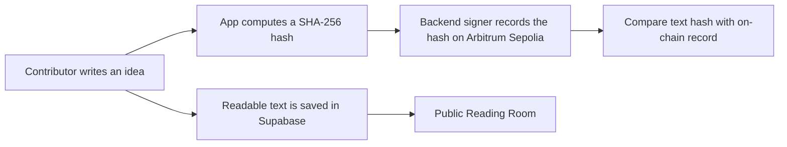

# Permanence Protocol

### An archive for ideas, questions, and the conversations they begin.

Permanence Protocol is an experimental public reading room. Contributors can preserve an idea and invite others to support it, challenge it, or add evidence. Readers can inspect the archive without signing in.

> **Prototype status:** This project currently records content hashes on **Arbitrum Sepolia**, a test network. Readable text is stored in Supabase. This is not a guarantee of permanent availability, authorship, truth, or priority.

## Why I designed this

I wanted to explore a simple question: what if an idea could leave a record that people can return to, check, and build on later?

Online posts can be difficult to find again, and a claim about who said something first can be difficult to verify. Permanence Protocol is my experiment in keeping an idea together with a time-stamped integrity check and a public conversation around it. An idea does not have to be proven to be worth preserving. The archive records what was submitted; it does not decide whether it is true.

This is an early prototype, not a solution to priority or authorship disputes. The chain can help check whether recovered text matches a recorded hash, but it cannot recreate missing text or prove that a contributor was the first person to think of an idea. I built this to explore the possibility, and to learn what a useful, honest archive needs to become.

## How a record works



The archive stores the readable text, contributor wallet attribution, transaction reference, and related metadata. The blockchain contract records the content hash and the backend signer address. The app displays the authenticated contributor's shortened wallet address as archive attribution. In this prototype, the contributor's wallet does **not** sign the on-chain transaction directly.

## What this does and does not establish

**It can help establish:**

- That specific text produces the same SHA-256 hash as a record currently readable from the Arbitrum Sepolia contract.
- That the hash was included in a transaction on that test network at a particular point in its history.
- Which contributor wallet the app associated with the archive entry, while the corresponding database row remains available.

**It does not establish:**

- The truth, quality, or originality of an idea.
- A contributor's real-world identity, or independent proof that their wallet authored the exact text.
- That someone was the first person anywhere to write or think of the idea.
- Recovery of readable text from a hash if the text and all copies or backups are lost.
- Guaranteed long-term availability. Arbitrum Sepolia is a test network, and the readable archive currently depends on Supabase and its backups.

## Explore the project

- **Public archive:** browse and search ideas without signing in.
- **Conversations:** expand an idea to read responses marked Support, Challenge, or Evidence.
- **Verification:** compare the archived text with its on-chain hash.
- **Contributions:** sign in with Privy to submit ideas and responses.
- **Motion-aware introduction:** the opening animation respects reduced-motion preferences.

## Technology

- Next.js 14, React 18, and TypeScript
- Supabase Postgres for readable archive data
- Privy for sign-in and wallet attribution
- Solidity and ethers.js for the Arbitrum Sepolia contract integration
- GSAP for the introduction animation

## Run locally

### Requirements

- Node.js 18 or newer
- npm
- A Supabase project
- A Privy app configured for your local development origin
- An Arbitrum Sepolia RPC endpoint and a funded testnet signer for posting

### Setup

1. Clone the repository and install dependencies:

   ```bash
   git clone https://github.com/Valorian0108/permanence-protocol.git
   cd permanence-protocol
   npm install
   ```

2. Copy `.env.example` to `.env.local` and fill in the values. In PowerShell:

   ```powershell
   Copy-Item .env.example .env.local
   ```

3. Configure Supabase. For a new database, apply `server/database/schema.sql`, then apply the SQL files in `server/database/migrations/` in date order. If you are using an existing project, check which migrations have already been applied before running them.

4. Add the local development origin to your Privy app's allowed origins. Restart the development server after changing environment variables.

5. Start the app:

   ```bash
   npm run dev
   ```

   Open [http://localhost:3000](http://localhost:3000).

The public archive needs the Supabase URL and anon key. Posting and verification also need the appropriate server-side Privy, Supabase service-role, and Arbitrum Sepolia settings. A server-side signer needs Sepolia test ETH to submit transactions. Never use a wallet containing valuable mainnet assets as the testnet signer.

Useful checks:

```bash
npm run build
npm run lint
```

## Environment variables

Use `.env.example` as the variable-name reference. Keep secret values in `.env.local` or your hosting provider's secret manager. Do not commit `.env` files, private keys, Privy secrets, or the Supabase service-role key.

| Variable | Used for | Secret? |
| --- | --- | --- |
| `NEXT_PUBLIC_PRIVY_APP_ID` | Privy client configuration | No |
| `NEXT_PUBLIC_SUPABASE_URL` | Supabase client URL | No |
| `NEXT_PUBLIC_SUPABASE_ANON_KEY` | Public archive reads | No, protect data with RLS |
| `PRIVY_APP_ID` | Server-side Privy verification | Treat as private configuration |
| `PRIVY_APP_SECRET` | Server-side Privy verification | Yes |
| `PRIVY_VERIFICATION_KEY` | Server-side token verification | Yes |
| `SUPABASE_URL` or `NEXT_PUBLIC_SUPABASE_URL` | Server-side database connection | No |
| `SUPABASE_SERVICE_ROLE_KEY` | Server-side archive writes | **Yes, highly privileged** |
| `PRIVATE_KEY` | Testnet transaction signer | **Yes, never expose to the browser** |
| `ARBITRUM_SEPOLIA_RPC_URL` | Arbitrum Sepolia RPC access | Keep provider credentials private |
| `ETHERSCAN_API_KEY` | Optional contract verification tooling | Yes |

## Database care

Readable ideas and responses live in Supabase. Keep independent backups and periodically test restoring one. Database recovery can restore readable content from a backup; the on-chain hash by itself cannot reconstruct it. Review your Supabase plan and backup settings because backup retention and recovery options vary.

Public archive entries should be treated as public. Before inviting contributors, explain what data is stored, how wallet attribution is displayed, and what the blockchain record means. Do not promise that a post can be erased from the network or recovered if every copy of its text is lost.

## Contract

- **Network:** Arbitrum Sepolia, chain ID `421614`
- **Contract:** [`0x213B5321d98B2E01204C827712Ca9D580cEF9bEd`](https://sepolia.arbiscan.io/address/0x213B5321d98B2E01204C827712Ca9D580cEF9bEd#code)
- **Deployment details:** [`deployment-info.json`](./deployment-info.json)

This is a test deployment. Do not treat it as a production contract or send it valuable assets.

## Contributing

Issues and thoughtful contributions are welcome. Please keep the project's central distinction clear: preserving a record is not the same as certifying a claim. For security-sensitive issues, avoid posting exploit details publicly until maintainers have had a chance to respond.

## License

No license has been added yet. Unless a license is added, the repository is not explicitly licensed for reuse. Add a license file before inviting others to reuse or redistribute the code.
